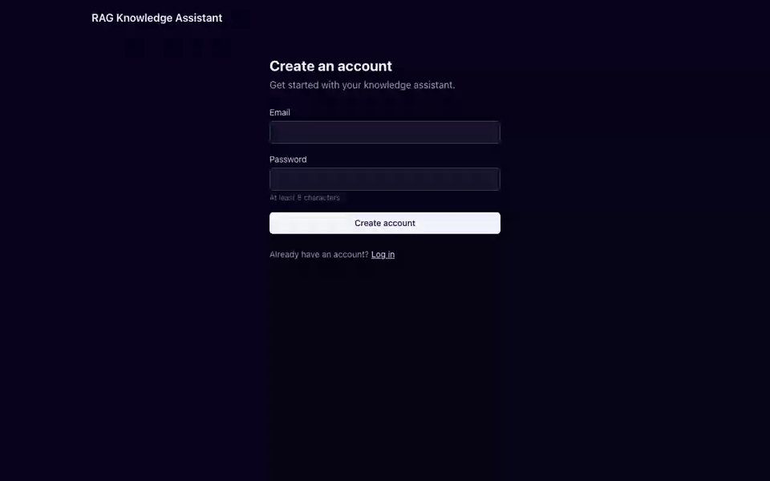
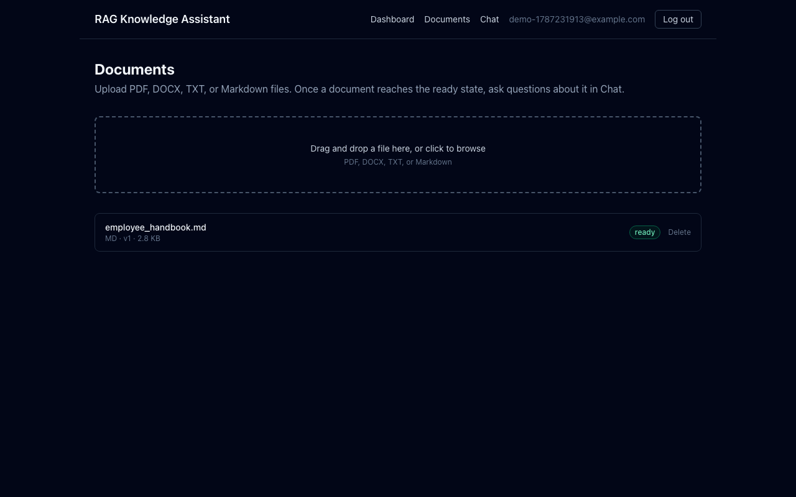
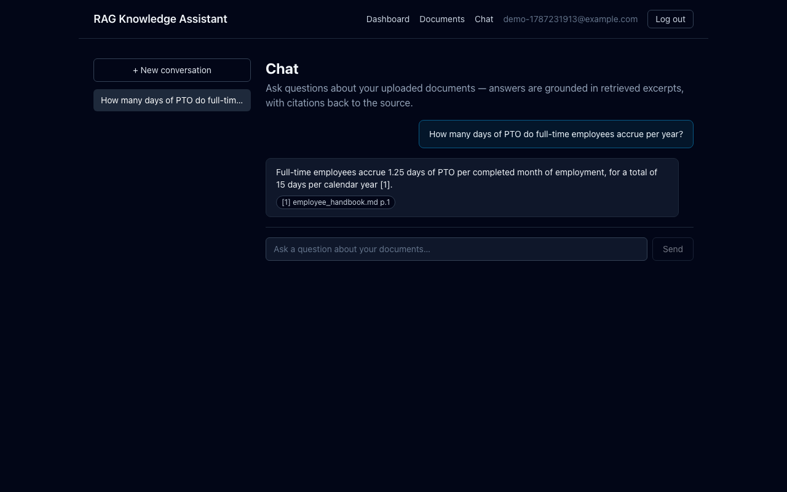

# RAG Knowledge Assistant

A production-grade, multi-user RAG (Retrieval-Augmented Generation) knowledge assistant: upload
documents, ask questions about them in a chat interface, and get answers grounded in your own
content with inline citations back to the exact source passage — not a generic LLM chat wrapper.

Built end to end as a demonstration of production engineering judgment, not just "get a demo
working": multi-tenant isolation, structure-aware document parsing, hybrid dense+keyword retrieval
with reciprocal rank fusion and cross-encoder reranking, two layers of hallucination mitigation,
rate limiting and security hardening, structured logging and metrics, a labeled
retrieval/generation evaluation harness, and a deployable production configuration. The full
design rationale — including the mistakes found and fixed along the way — is recorded in
[`docs/ARCHITECTURE.md`](docs/ARCHITECTURE.md) and [`docs/PROGRESS.md`](docs/PROGRESS.md).



*Captured against a live local instance — register → upload → chat, end to end, with a real
generated, cited answer. By default this runs entirely on local models (`sentence-transformers`
for embeddings, Ollama for generation — see § Local-first by default below) — no API key required
at all. OpenAI is fully supported as an alternate provider for either or both, if you'd rather use
it.*

## What it does

1. **Register / log in** — email + password, JWT access + refresh tokens in `httpOnly` cookies.
2. **Upload a document** (PDF, DOCX, TXT, or Markdown) — parsed, split into structure-aware
   chunks (respecting headings, not fixed-size windows), embedded, and indexed, entirely in the
   background.
3. **Ask a question in the chat UI** — the system rewrites your question using conversation
   history, retrieves candidates from two independent search methods (dense vector similarity +
   Postgres full-text/BM25), fuses them with Reciprocal Rank Fusion, reranks the fused set with a
   local cross-encoder model, and either generates a **streamed, cited answer** grounded only in
   what was retrieved, or **honestly declines** if nothing retrieved is actually relevant enough.
4. Every other user's documents are invisible to you — isolation is enforced at the query level,
   not just the UI.

## Screenshots

| Document processing, ready with local embeddings | A grounded, cited answer in the chat UI |
|---|---|
|  |  |

Both were captured against the default configuration — `EMBEDDING_PROVIDER=local`,
`CHAT_PROVIDER=ollama` — with no API key configured anywhere in the environment. If a downstream
dependency genuinely is unavailable (OpenAI, Ollama, or Qdrant unreachable), the system still
degrades gracefully instead of hanging or crashing: see `docs/ARCHITECTURE.md` § Error handling
and § Configurable LLM & embedding providers for that path. More frames (registration, dashboard,
empty states) are in [`docs/screenshots/`](docs/screenshots/).

## Architecture

```
                         ┌─────────────┐
                         │   Browser   │
                         └──────┬──────┘
                                │ HTTPS (REST + SSE streaming)
                         ┌──────▼──────┐
                         │  Frontend   │  Next.js (App Router) — auth, upload,
                         │  (Next.js)  │  document list, streaming chat UI
                         └──────┬──────┘
                                │
                         ┌──────▼──────┐         ┌─────────────┐
                    ┌───►│   Backend   │◄───────►│    Redis    │  per-user rate
                    │    │  (FastAPI)  │         │             │  limits + Celery
                    │    └──┬───────┬──┘         └──────┬──────┘  broker/results
                    │       │       │                   │
             ┌──────┴───┐   │  ┌────▼───────┐    ┌──────▼──────┐
             │ Postgres │   │  │   Qdrant   │    │   Celery    │
             │ users ·  │◄──┘  │   chunk    │◄───│   worker    │  parse → chunk →
             │ docs ·   │      │  vectors   │    │             │  embed → index
             │ chunks+  │      └────────────┘    └──────┬──────┘  (async, per upload)
             │ FTS      │                                │
             └──────────┘                         ┌──────▼──────┐
                                                    │   OpenAI    │  embeddings + chat
                                                    │  (or eval's │  completion
                                                    │  synthetic  │
                                                    │  fallback)  │
                                                    └─────────────┘
```

The retrieval + generation pipeline, the part actually worth diagramming on its own:

```
upload ──► parse ──► structure-aware chunk ──► embed ──► index (Qdrant + Postgres FTS)

question ──► rewrite (uses conversation history) ──┬──► dense search (Qdrant)      ──┐
                                                     └──► BM25 search (Postgres FTS) ──┼──► RRF fusion
                                                                                        │
                          grounded, cited answer  ◄── LLM ◄── prompt ◄── cross-encoder rerank
                          (or an honest decline if the best rerank score is too low)
```

## Quickstart (local, one command)

Requires Docker + Docker Compose v2. No API key needed.

```bash
cp backend/.env.example backend/.env
docker compose -f infra/docker-compose.yml up --build
```

- Frontend: http://localhost:3000
- Backend API: http://localhost:8000 (interactive docs at `/docs`)
- Health check: `curl localhost:8000/health`

Register an account, upload a PDF/DOCX/TXT/MD file, wait for it to finish processing (the document
list polls status), then ask a question about it in the chat — you'll get a real generated,
cited answer, not a decline or an error, since everything in this path runs on local models by
default.

First boot pulls the local chat model (`llama3.2:3b`, ~2GB) via the `ollama-init` service before
`backend`/`celery-worker` start — a one-time cost, cached in a Docker volume after. The local
embedding model and reranker are baked into the backend image at build time, so they add no
runtime download at all.

### Local-first by default

`EMBEDDING_PROVIDER=local` (`sentence-transformers`/`BAAI/bge-small-en-v1.5`) and
`CHAT_PROVIDER=ollama` (a `llama3.2:3b` model served by a sibling `ollama` container) are both the
defaults — the whole pipeline, including generation, works with zero external API key. OpenAI is
fully supported as an alternate provider for either or both (`EMBEDDING_PROVIDER=openai`,
`CHAT_PROVIDER=openai` — see `backend/.env.example`), if you'd rather use it (typically for higher
answer quality than a small local model, at the cost of a paid key). See
`docs/ARCHITECTURE.md` § Configurable LLM & embedding providers for the full design.

The **test suite and eval harness** additionally have their own deterministic, offline synthetic
fallback for OpenAI specifically, independent of the local-provider defaults above, so both stay
fully runnable even with `EMBEDDING_PROVIDER=openai`/`CHAT_PROVIDER=openai` set and no real key
configured (see `eval/run_eval.py::detect_mode` and `backend/tests/helpers.py`).

## Running tests and the evaluation harness

```bash
cd backend
uv sync --dev
uv run alembic upgrade head
uv run pytest                       # 209 tests, ~97% coverage
uv run pytest --cov --cov-report=term-missing

uv run pytest ../eval/tests         # eval harness's own unit tests (metrics math)
uv run python ../eval/run_eval.py   # full retrieval + generation evaluation report
```

### Demo

Terminal recording of the real retrieval evaluation running end to end:


This is the actual, unedited terminal output of a real run against a live Postgres + Qdrant — every
`retrieval_complete` line and every number in the final table is genuine, not staged (a handful of
the 21 per-query log lines are shown for length; the full run logs all of them). No `OPENAI_API_KEY`
was available in this environment, so embeddings/generation/judge fall back to the harness's
documented synthetic mode — but the **retrieval pipeline itself (dense search, BM25, RRF fusion,
and the local cross-encoder reranker) all ran for real**, which is what these Recall@K/MRR/NDCG
numbers actually measure. See [`eval/RESULTS.md`](eval/RESULTS.md) for what that mode does and
doesn't demonstrate, and rerun it yourself with a real key for real generation numbers too.

The eval harness runs the real retrieval pipeline (dense-only, BM25-only, and fused+reranked) and
real local cross-encoder reranker against a 21-query labeled dataset, reporting Recall@K, MRR, and
NDCG@5 per variant, plus LLM-as-judge faithfulness and answer-relevance scores. See
[`eval/RESULTS.md`](eval/RESULTS.md) for the current numbers and an honest account of what they do
and don't demonstrate (including a real calibration bug the harness found and fixed —
`rag_min_rerank_score` was rejecting a genuinely correct answer).

All of the above needs a real Postgres/Qdrant (and Redis, for the main test suite) — either the
dev compose stack (`docker compose -f infra/docker-compose.yml up -d postgres redis qdrant`) or
any equivalent. CI runs the identical sequence against ephemeral service containers on every push.

## Design decisions

The interesting engineering is documented in depth in
[`docs/ARCHITECTURE.md`](docs/ARCHITECTURE.md). The highlights:

- **Structure-aware chunking, not fixed-size windows.** Documents are parsed into blocks carrying
  their heading path, then packed into token-bounded chunks that never merge across a heading
  boundary and only apply overlap within a section — a chunk about "Expense Reimbursement" never
  silently absorbs half of "Code of Conduct" just because they happened to fit a token budget
  together.
- **Hybrid retrieval: dense + BM25, fused with Reciprocal Rank Fusion, then reranked.** Dense
  (embedding) search and Postgres full-text search fail in different, complementary ways — dense
  search misses exact terms/codes it hasn't learned to associate; keyword search misses paraphrase
  and synonymy. RRF combines both rankings without needing to calibrate two incomparable score
  scales against each other, and a local cross-encoder reranking pass over the fused candidates
  earns its latency cost measurably: the eval run showed hybrid+reranked hitting a perfect
  Recall@5/MRR/NDCG@5 even with a deliberately degraded dense leg, fully compensating for it.
- **Two layers of hallucination mitigation, one deterministic.** The system prompt instructs the
  model to answer only from the provided context and cite every claim — that's a soft constraint,
  not a guarantee. The hard constraint sits in front of generation entirely: if the best retrieved
  candidate's cross-encoder rerank score falls below a threshold, the system declines before ever
  calling the LLM. That threshold isn't a guess left unchecked — it was recalibrated using the eval
  harness after it caught the *original* guessed value (`0.0`) rejecting a genuinely correct
  top-ranked answer, from an actual observed score distribution (19 true positives at +2.5 to
  +10.25, one outlier at -1.64, one labeled negative at -9.85) rather than intuition.
- **An evaluation harness that's honest about its own limitations.** Rather than asserting
  metrics cross some threshold, `eval/run_eval.py` produces a report a person reads, and
  `eval/RESULTS.md` says plainly which numbers are real (the local reranker, Postgres FTS — no API
  key needed for either) versus synthetic-mode mechanics validation (when no `OPENAI_API_KEY` is
  configured), rather than letting a reader mistake one for the other.
- **Multi-tenant isolation enforced at the query layer, not just checked at the API boundary.**
  Every repository method that reads data requires a `user_id` and filters on it — there is no
  "search everything" method to accidentally call from the wrong context, in Postgres or in
  Qdrant.
- **Fail fast on insecure production configuration.** The app refuses to start outside
  local/test with the default JWT secret or a wildcard CORS origin — a loud crash on boot beats a
  quiet security hole running for months.

## Deployment

`docker-compose.prod.yml` (repo root) is the production configuration: internal services
(Postgres/Redis/Qdrant) publish no ports, every service has resource limits and a restart policy,
Redis and Qdrant require authentication, and database migrations run automatically as a one-shot
step before the API/worker start — no manual `alembic upgrade` in the deploy flow.

```bash
cp .env.prod.example .env    # fill in every value — real secrets, your real domain(s)
docker compose -f docker-compose.prod.yml up -d --build
./scripts/smoke_test.sh      # register -> login -> upload -> ask -> cited answer
```

`scripts/smoke_test.sh` is the actual final-verification checklist, runnable against
either compose file — it distinguishes "the pipeline is broken" from "no real `OPENAI_API_KEY` is
configured" (the latter is expected and reported as such, not a failure) so it stays useful in an
eval-only environment as well as a fully-configured one.

**Target: a single VM running Docker Compose**, chosen deliberately over Kubernetes or a managed
PaaS (Fly/Railway/Render) for a project at this scope: the engineering content worth demonstrating
here is the RAG pipeline (chunking, hybrid retrieval, reranking, hallucination mitigation, eval
methodology), not infrastructure orchestration — a single-VM Compose deployment is fully
inspectable in this repo with no platform-specific config to translate, costs one VM, and every
command in this README works identically whether you're running it on a laptop or a $6/month box.
Kubernetes would be legitimate at a scale this project isn't at (multiple regions, need for
autoscaling, a team operating it); a managed PaaS would be a reasonable *alternative* choice
(genuinely less ops burden) but was passed over specifically so the deployment story stays
transparent and inspectable as part of the portfolio, rather than "trust the platform." See
`docs/ARCHITECTURE.md` § Production deployment for the full reasoning, including what's explicitly
deferred (TLS/reverse proxy, S3 storage, Kubernetes, multi-region — see "Status" below).

CI (`.github/workflows/ci.yml`) builds and pushes tagged backend/frontend images to GHCR on every
merge to `main`, after lint, the full test suite, and the dependency audits
(`pip-audit`/`npm audit`) all pass. Actually rolling a new image out to a running VM is a
documented manual step, not automated in this repo (there's no real target host to test an
auto-deploy job against) — `ssh` in, `docker compose -f docker-compose.prod.yml pull && docker
compose -f docker-compose.prod.yml up -d`, or use the SHA-tagged image if you want to pin to a
specific build rather than float on `:latest`.

## Project structure

```
.
├── backend/    FastAPI application (Python, uv) — routers/services/repositories/models
├── frontend/   Next.js application (TypeScript) — auth, upload, chat UI
├── infra/      dev docker-compose.yml + Dockerfiles (shared by dev and prod builds)
├── eval/       RAG evaluation harness — dataset, metrics, CLI, results
├── docs/       ARCHITECTURE.md (technical rationale) + PROGRESS.md (build log)
├── docker-compose.prod.yml   production compose file (see Deployment above)
├── .env.prod.example         production secrets/overrides template
└── .github/workflows/        CI: lint, test, dependency audit, image build+push
```

## Status

The full planned scope is complete — see [`docs/PROGRESS.md`](docs/PROGRESS.md) for the full,
honest history (including bugs found during verification and how they were fixed) and
[`docs/ARCHITECTURE.md`](docs/ARCHITECTURE.md) for the technical design of every piece. Explicitly
out of scope, not silently omitted — see `ARCHITECTURE.md`'s "What's deliberately deferred"
section for the complete list and reasoning: S3 storage (an abstraction exists, no second
implementation), a TLS-terminating reverse proxy in front of the production compose stack,
Kubernetes/multi-region deployment, conversation deletion and older-turn summarization, CSRF
tokens beyond `SameSite`, and growing the eval dataset's labeled negative examples to further
validate `rag_min_rerank_score`.
