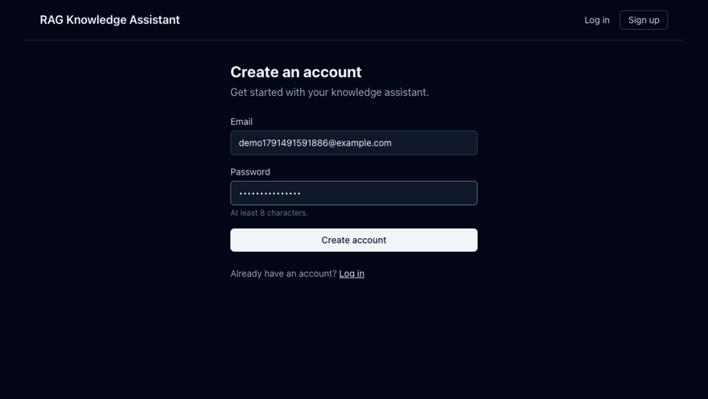
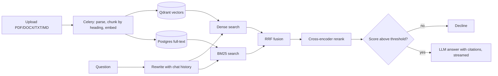

# HybridRAG

Multi-user document Q&A: hybrid dense + BM25 retrieval, cross-encoder reranking, cited streamed answers, and an honest "I don't know" when the documents don't contain the answer.

[](https://github.com/nithya-prakash/HybridRAG/actions/workflows/ci.yml)  



*Register → upload → chat, against a local instance (local models, no API key).*

## Results

Measured on my own labeled set: 116 questions over 8 documents (99 answerable, 17 not). Retrieval and guard numbers are from 2026-09 runs of the commands below; generation was re-run 2026-10-08.

| What | Result |
|---|---|
| Retrieval, dense + BM25 + RRF + reranker | Recall@1 **0.929**, Recall@5 **1.000**, MRR **0.980** |
| Dense only (baseline) | Recall@1 0.924, Recall@5 0.995, MRR 0.976 |
| BM25 only (baseline) | Recall@1 0.798, Recall@5 0.975, MRR 0.900 |
| Hallucination guard (decline before generating) | accuracy 93.1%, precision 76.5%, recall 76.5% |
| Generation, `qwen2.5:3b` local, 20-question sample | faithfulness 0.43, correctness 0.50, abstained correctly 16/20 |
| RAGAS cross-check, same 20 answers | context precision 0.43 (14 of 15 answered queries scored). RAGAS faithfulness failed: the 3B judge timed out or returned unparseable output on every sample, so no score |
| Tests | 247 backend + 34 eval, ruff clean |

Honest reading: the corpus is small and clean, so retrieval is near ceiling and the reranker adds only about +0.5 point of Recall@1 over dense alone. Generation quality is limited by the 3B local model, not by retrieval. Details and caveats: [eval/RESULTS.md](eval/RESULTS.md).

## Quickstart

```bash
cp backend/.env.example backend/.env
docker compose -f infra/docker-compose.yml up --build
```

Frontend http://localhost:3000, API docs http://localhost:8000/docs. First boot pulls `llama3.2:3b` (~2 GB). Hosted demo (free tier, backend may be asleep or down): [hybridrag-nithya-prakash.vercel.app](https://hybridrag-nithya-prakash.vercel.app).

| Variable | Purpose |
|---|---|
| `CHAT_PROVIDER` | `ollama` (default), `openai`, `groq` or `gemini` |
| `EMBEDDING_PROVIDER` | `local` (default, bge-small) or `openai` |
| `OLLAMA_BASE_URL`, `OLLAMA_CHAT_MODEL` | local model endpoint and name |
| `OPENAI_API_KEY`, `GROQ_API_KEY`, `GEMINI_API_KEY` | only for the matching hosted provider |
| `JWT_SECRET_KEY`, `CORS_ORIGINS` | must be set to non-defaults outside local/test; the app refuses to start otherwise |

## How it works


```mermaid
flowchart LR
  U[Upload PDF/DOCX/TXT/MD] --> C[Celery: parse, chunk by heading, embed]
  C --> Q[(Qdrant vectors)]
  C --> P[(Postgres full-text)]
  A[Question] --> R[Rewrite with chat history]
  R --> D[Dense search] & B[BM25 search]
  Q --> D
  P --> B
  D & B --> F[RRF fusion] --> X[Cross-encoder rerank]
  X --> G{Score above threshold?}
  G -- no --> N[Decline]
  G -- yes --> L[LLM answer with citations, streamed]
```

Stack: FastAPI, Postgres, Qdrant, Redis/Celery, Next.js. Every query is filtered by user at the retrieval layer, so one user cannot see another's documents. More in [docs/ARCHITECTURE.md](docs/ARCHITECTURE.md).

## Usage

1. Register, log in (JWT in httpOnly cookies, CSRF token).
2. Upload documents on the Documents page; wait for status `ready`.
3. Ask questions in Chat. Answers stream with inline citations, or the app declines.

Optional: `automation/n8n/document_intake.json` is an n8n workflow that ingests a file by URL. Run end to end once in n8n 2.42.5 (ingest returned `ready`); see `automation/n8n/README.md` for what was and wasn't covered.

## Limitations

- Guard recall tops out at 76.5%: about 1 in 4 unanswerable questions still reaches the LLM. A threshold sweep found no better setting.
- Evaluation set is 116 questions over 8 documents I wrote or chose, so it is small and not independent. Generation numbers use a 20-question sample, and the judge is the same 3B model that wrote the answers.
- Fine-tuning the reranker on this corpus changed no ranking (null result, p = 1.0), so it is not used. Details in [docs/details.md](docs/details.md).
- Local generation is slow on CPU (tens of seconds per answer).
- Gemini, Groq and OpenAI chat paths are covered by unit tests only, never run live (no paid keys).
- Hosted demo runs on free tiers; the Render backend was unreachable on 2026-10-08.
- Single-VM Docker Compose deployment; no Kubernetes, TLS proxy or automated CD.

## Repository layout

```
backend/   FastAPI app, Alembic migrations, tests
frontend/  Next.js UI
eval/      labeled dataset, metrics, run scripts, RAGAS cross-check, reranker experiment
infra/     dev docker-compose and Dockerfiles
docs/      ARCHITECTURE, API, DEPLOY_FREE_TIER, PROGRESS, details
automation/n8n/  document-intake workflow (run once, see its README)
```

## Checks

```bash
cd backend && uv sync --dev && uv run alembic upgrade head
uv run ruff check . && uv run pytest              # backend tests
uv run pytest ../eval/tests                       # eval tests
uv run python ../eval/run_eval.py --retrieval-only   # retrieval table, no LLM
uv run python ../eval/run_all.py                  # retrieval + guard + latency
pip install -r ../eval/requirements-ragas.txt     # in a separate venv
python ../eval/ragas_eval.py ../eval/results/generation_qwen2.5-3b.json
```

CI runs lint, tests, dependency audit, eval and image builds on every push.

## Roadmap and license

Next: evaluate with a stronger judge model, grow the question set beyond 8 documents, a hosted demo that stays up. MIT, see [LICENSE](LICENSE).
